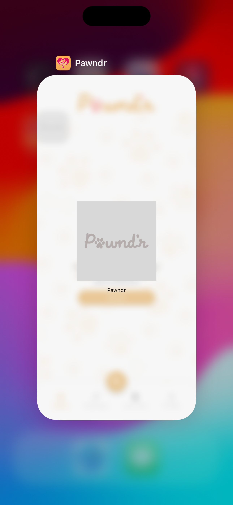

<!--
This README describes the package. If you publish this package to pub.dev,
this README's contents appear on the landing page for your package.

For information about how to write a good package README, see the guide for
[writing package pages](https://dart.dev/guides/libraries/writing-package-pages).

For general information about developing packages, see the Dart guide for
[creating packages](https://dart.dev/guides/libraries/create-library-packages)
and the Flutter guide for
[developing packages and plugins](https://flutter.dev/developing-packages).
-->

This is an internal package named App Switcher Protection which helps in local authentication i.e. biometric + passcode. In most of the app we do not need the app switcher view where as in some app where the privacy and security is most we can add this package to have local authentication or a screenshield to show/hide the app content.

## Features

1. Local authentication with biometric or passcode.
2. App switcher protection view

## Usage
If you do not need the local authentication but only a shield when we are switching the app, you can use it even then.

1. Open your main.dart file or main point of entry of your project.
2. Make the `AppSwitcherProtection` Widget as your first child or n-th child that wraps your main Screen of the app. For example

```
void main() async {
  runApp(
    EasyLocalization(
        supportedLocales: const [Locale('en', 'US')],
        path: 'assets/translations',
        fallbackLocale: const Locale('en', 'US'),
        child: const EchoWaterApp()),
  );
}


class EchoWaterApp extends StatefulWidget {
  const EchoWaterApp({super.key});

  @override
  State<EchoWaterApp> createState() => _PawndrAppState();
}

class _PawndrAppState extends State<PawndrApp> {
  final _navigatorKey = GlobalKey<NavigatorState>();
  NavigatorState? get _navigator => _navigatorKey.currentState;
  final GlobalKey<AppSwitcherProtectionState> _appSwitcherProtectionViewKey =
      GlobalKey();
  @override
  void initState() {
    
    SystemChrome.setSystemUIOverlayStyle(const SystemUiOverlayStyle(
      statusBarColor: Colors.transparent, // transparent status bar
    ));
    SystemChrome.setPreferredOrientations([
      DeviceOrientation.portraitUp,
    ]);
    super.initState();

  }

  @override
  Widget build(BuildContext context) {
    return MultiBlocProvider(
      providers: const [
        // your bloc providers
      ],
      child: MaterialApp(
          builder: (context, child) {
            return AppVersionCheckerView(
                  textColor: Theme.of(context).colorScheme.primaryElementColor,
                  child: AppSwitcherProtection(
              key: _appSwitcherProtectionViewKey,
              usesBiometricAuthentication: false,
              maxNotMatchCountLimit: 3, // no. of times to let user retry authentication
              switcherWidget: Column( // your custom overlay ontop of blur view
                children: [
                  Image.asset(
                    FlavorConfig.appIconImage(),
                    width: MediaQuery.of(context).size.width * 0.5,
                    height: MediaQuery.of(context).size.width * 0.5,
                  ),
                  const Padding(
                    padding: EdgeInsets.only(top: 15),
                    child: Text(
                      Constants.appName,
                      style: TextStyle(color: Colors.black),
                    ),
                  )
                ],
              ),
              hasAppShield: true, // if you want to show the blurred sheild.
              evictLoggedInUser: () {
               // handle your user eviction logic here
              },
              child: Container() // your base navigation screen or logic here,
            )
                );
          },
          onGenerateRoute: (settings) {
            return SplashPage.route();
          }),
    );
  }
}
````

You can see how I have added `AppSwitcherProtection` as child of `AppVersionCheckerView` acting as a wrapper widget of my main container app widget.

BTW, `AppVersionCheckerView` is our another internal package which you can check it at:
https://github.com/OutCode-Software/app_version_checker

Taking about the parameter of the `AppSwitcherProtection`

key: The state key which we will be needed to update if we need local auth or not like for example, if we are not logged in, we would not need it else when logged in we will need it.
so, we do
```
_appSwitcherProtectionViewKey.currentState
                            ?.updateProtectionState(needsAuth: true or flase);
```
`usesBiometricAuthentication`: boolean value to indicate, if we use local biometric auth or not.

`maxNotMatchCountLimit`: optional parameter, max number of retries for authentication which is 3 by default.

`switcherWidget`: An optional widget to show on top of the blutter backdrop for project branding.

`hasAppShield`: boolean value to indicate if we need the app shield or not.

`evictLoggedInUser`: a call back when local authentication fails after x tries to authenticate.

`child`: Main app container

   

