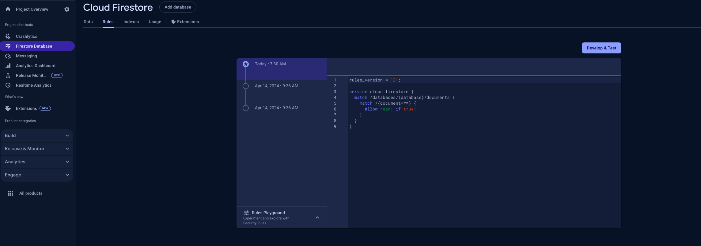
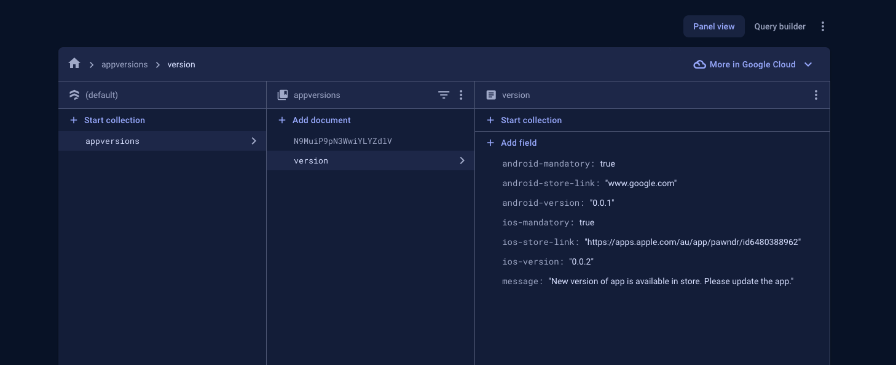

<!--
This README describes the package. If you publish this package to pub.dev,
this README's contents appear on the landing page for your package.

For information about how to write a good package README, see the guide for
[writing package pages](https://dart.dev/guides/libraries/writing-package-pages).

For general information about developing packages, see the Dart guide for
[creating packages](https://dart.dev/guides/libraries/create-library-packages)
and the Flutter guide for
[developing packages and plugins](https://flutter.dev/developing-packages).
-->

App Version Checker is an straight forward implementation leveraging firebase firestore to check app version. We need app version checking in all projects. Yes, there is automatic version updating mechanism but what if the user has turned it off but there are breaking changes in our system and we mandatorily need the app version updated for the user?

## Installation
The process is fairly simple.

1. Open your main.dart file or main point of entry of your project.
2. Make the `AppVersionCheckerView` Widget as your first child or n-th child that wraps your main Screen of the app. For example:

```
void main() async {
  runApp(
    EasyLocalization(
        supportedLocales: const [Locale('en', 'US')],
        path: 'assets/translations',
        fallbackLocale: const Locale('en', 'US'),
        child: const PawndrApp()),
  );
}


class PawndrApp extends StatefulWidget {
  const PawndrApp({super.key});

  @override
  State<PawndrApp> createState() => _PawndrAppState();
}

class _PawndrAppState extends State<PawndrApp> {
  final _navigatorKey = GlobalKey<NavigatorState>();
  NavigatorState? get _navigator => _navigatorKey.currentState;

  @override
  void initState() {
    
    SystemChrome.setSystemUIOverlayStyle(const SystemUiOverlayStyle(
      statusBarColor: Colors.transparent, // transparent status bar
    ));
    SystemChrome.setPreferredOrientations([
      DeviceOrientation.portraitUp,
    ]);
    super.initState();

  }

  @override
  Widget build(BuildContext context) {
    return MultiBlocProvider(
      providers: const [
        // your bloc providers
      ],
      child: MaterialApp(
          builder: (context, child) {
            return OCBugReporterWapperScreen(
                navigatorKey: _navigatorKey,
                listId: FlavorConfig.clickUpListId(),
                apiKey: FlavorConfig.clickUpApiKey(),
                imageString: FlavorConfig.appIconImage(),
                isVisible: !FlavorConfig.isProduction(),
                child: AppVersionCheckerView(
                  textColor: Theme.of(context).colorScheme.primaryElementColor,
                  child: Container()
                )
              );
          },
          onGenerateRoute: (settings) {
            return SplashPage.route();
          }),
    );
  }
}
````

You can see how I have added `AppVersionCheckerView` as child of `OCBugReporterWapperScreen` acting as a wrapper widget of my main container app widget.

BTW, `OCBugReporterWapperScreen` is our another internal package which you can check it at:
https://github.com/OutCode-Software/oc_bug_reporter

Taking about the parameter of the `AppVersionCheckerView`
textColor: The color of text in the dialog of the bug reporter. 

### Prerequisite:
1. Geting your firebase project up and integrated.
2. Add Firestore in your project in Firebase Console.
3. Update the rule and allow read true.
   


4. Create a new document `version` in collection `appversions` with your values on the keys as shown, ignore the aother docuement in screenshot

