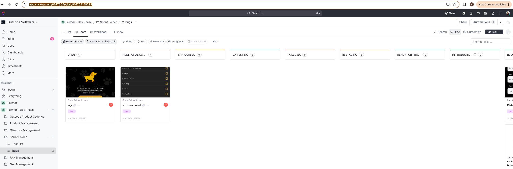
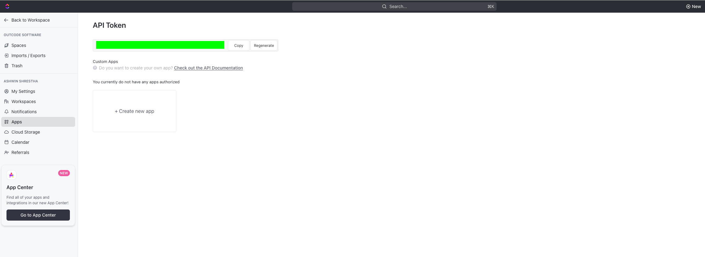
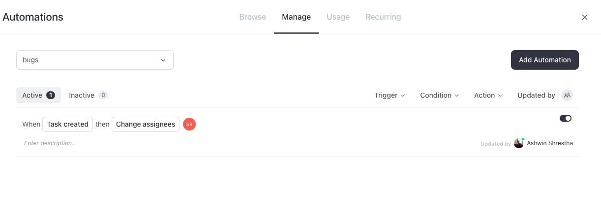

<!--
This README describes the package. If you publish this package to pub.dev,
this README's contents appear on the landing page for your package.

For information about how to write a good package README, see the guide for
[writing package pages](https://dart.dev/guides/libraries/writing-package-pages).

For general information about developing packages, see the Dart guide for
[creating packages](https://dart.dev/guides/libraries/create-library-packages)
and the Flutter guide for
[developing packages and plugins](https://flutter.dev/developing-packages).
-->

This is an internal package named OC Bug Reporter which helps in reporting flutter app bugs to click up which we use in our company as the project management tool. 

## Features

1. Easy creation of bug report with tap on the reporter floating icon.
2. Add/Edit image of current screen of the report

## Usage
The main idea for this tool is to give an easy access to anyone who is testing the application to report the bug with no hassle of opening the click up and adding the bug report there.

1. Open your main.dart file or main point of entry of your project.
2. Make the `OCBugReporterWapperScreen` Widget as your first child or n-th child that wraps your main Screen of the app. For example

```
void main() async {
  runApp(
    EasyLocalization(
        supportedLocales: const [Locale('en', 'US')],
        path: 'assets/translations',
        fallbackLocale: const Locale('en', 'US'),
        child: const PawndrApp()),
  );
}


class PawndrApp extends StatefulWidget {
  const PawndrApp({super.key});

  @override
  State<PawndrApp> createState() => _PawndrAppState();
}

class _PawndrAppState extends State<PawndrApp> {
  final _navigatorKey = GlobalKey<NavigatorState>();
  NavigatorState? get _navigator => _navigatorKey.currentState;

  @override
  void initState() {
    
    SystemChrome.setSystemUIOverlayStyle(const SystemUiOverlayStyle(
      statusBarColor: Colors.transparent, // transparent status bar
    ));
    SystemChrome.setPreferredOrientations([
      DeviceOrientation.portraitUp,
    ]);
    super.initState();

  }

  @override
  Widget build(BuildContext context) {
    return MultiBlocProvider(
      providers: const [
        // your bloc providers
      ],
      child: MaterialApp(
          builder: (context, child) {
            return OCBugReporterWapperScreen(
                navigatorKey: _navigatorKey,
                listId: FlavorConfig.clickUpListId(),
                apiKey: FlavorConfig.clickUpApiKey(),
                imageString: FlavorConfig.appIconImage(),
                isVisible: !FlavorConfig.isProduction(),
                child: Container() // your base navigation screen or logic here,
              );
          },
          onGenerateRoute: (settings) {
            return SplashPage.route();
          }),
    );
  }
}
````

You can see how I have added OCBugReporterWapperScreen as a wrapper widget of my main container app widget.

Taking about the parameter of the `OCBugReporterWapperScreen`
```
navigatorKey:  Your main Navigator key of the project
listId: The click up list id where the bug reports will be posted
apiKey: Your Project's Click Up api Key
imageString: The Local Asset image String that will show as a floating view in your app
isVisible: a boolean value, indicating if the bug reporter needs to show or not
```

## Additional information

#### Geting your click up list id:
1. Open Click Up and navigate to your list where you want to report the bugs
2. In your navigation bar, you will see the url in the format:
`https://app.clickup.com/8677555/v/b/li/901702159299` here: `901702159299` is your list Id



#### Getting your click up api key
1. Open Click up and navigate to dashboard.
2. On top left open side menu and click  Settings
3. On side menu apps, you can generate an api key as shown in image below
   


And then you are all set.

#### Adding Automation
You can add automation in which when a bug is created via api using our OC Bug Reporter, that can be assiged to a member of the team (preferebally project manager) who is responsible for reassigning it to correct developer.

1. Go to your click up bug list 
2. On top Right, there you will see automation button.
3. Add Automation
4. In image below I have added an automation.


