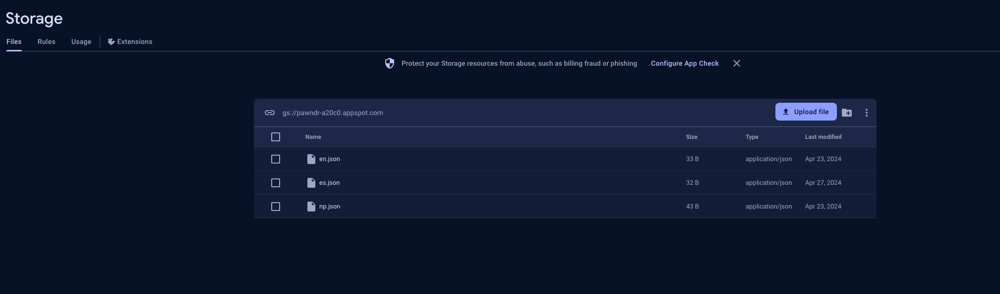
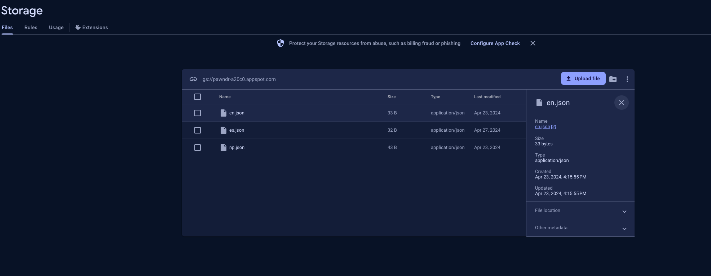
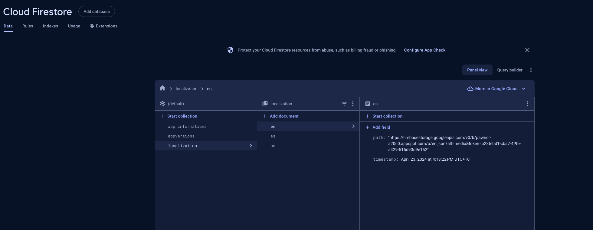
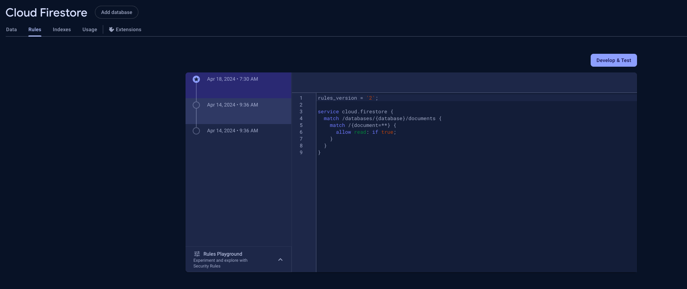
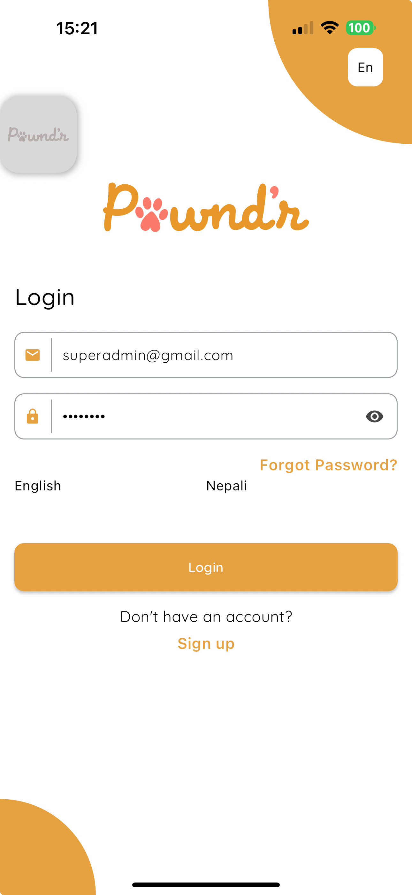

# Remote Localization

We usually dont add localization support in apps unless explicity mentioned by client as a part of estimation, which are going to change. We will be having localization, atleast extract out english in all projects from now.

This package is an example of remote localization support which utilizes firebase firestore and storrage as localization implementation in this library right now which we can always add more concrete implementation as we enhancing this library.

There are few techologies implemented in this in respect to firebase remote localization:

1. GCP Storage: 
   
   This is used to store our localization json files. 
   For example, we have a json file `en.json` where we have all the localized texts such as:
   ```
    {
	    "LoginScreen_welcome": "Hello"
    }
   ```
   Similarly json file for nepali, `ne.json`.

    ```
    {
	    "LoginScreen_welcome": "लोगिन"
    }
   ```


   You will need to upload it in firebasse storage as shown below:
   

   Now for the link of the image:
    

    You will need to use this link in firestore.

2. GCP Firestore:
   
   Now we need to create new collection named `localization` and documents as per your language => language code as shown in image below along with fields as in image
   Note: `timestamp` need to be of type timestamp.

   

   Similarly, the rule to fetch also need to be updated to make it readable.

   

3. Updating language or adding new language:
   
   If suppose, you add new key in some language. You delete the old json from storage, get it's link and then in firestore, update the path. At the same time, update the timestamp to the current as well. 

   Reason for updating timestamp is so that all will validate if new content has been added based on old content date. If the logic finds new item, it will delete the old one and caches new json to load as the localization.

4. App configuration:

```
void main() async {
  WidgetsFlutterBinding.ensureInitialized();

  await Firebase.initializeApp(
    options: DefaultFirebaseOptions.currentPlatform,
  );
  await FirebaseRemoteLocalizationService().initService();
  await EasyLocalization.ensureInitialized();

  FirebaseRemoteLocalizationService().onLocaleChanged = () {
      setState(() {});
    };

  runApp(
    EasyLocalization(
        supportedLocales: FirebaseRemoteLocalizationService().getLocales(),
        path: 'assets/translations',
        fallbackLocale: const Locale('en', 'US'),
        assetLoader: FirebaseRemoteLocalizationService().assetLoader,
        child: const PawndrApp()),
  );
}
```

We are using `EasyLocalization` for localization.

Note: We have initialized FirebaseRemoteLocalizationService with `await`

Some of the parameters details:

`supportedLocales`: Concrete implementation of `RemoteLocalizationService.getLocales()`

`assetLoader`: `FirebaseRemoteLocalizationService()`

### How to open language changer?



As in example above, in top right.. if you want this, you can add:

```
IconedTextChangeWidget(
    service:
    FirebaseRemoteLocalizationService(),
)
```

`FirebaseRemoteLocalizationService` is a singleton, so its all good.


Now if you want to show the language chooser, yourself without the above button which dynamically shows all the available language resource, call 

```
FirebaseRemoteLocalizationService().showLocaleChangeSheet(context);
```


And all set !!!! :) 


